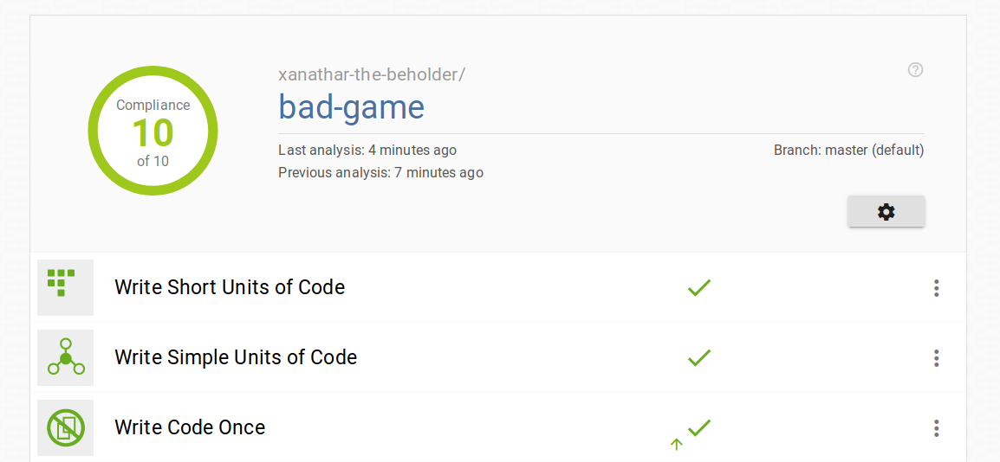
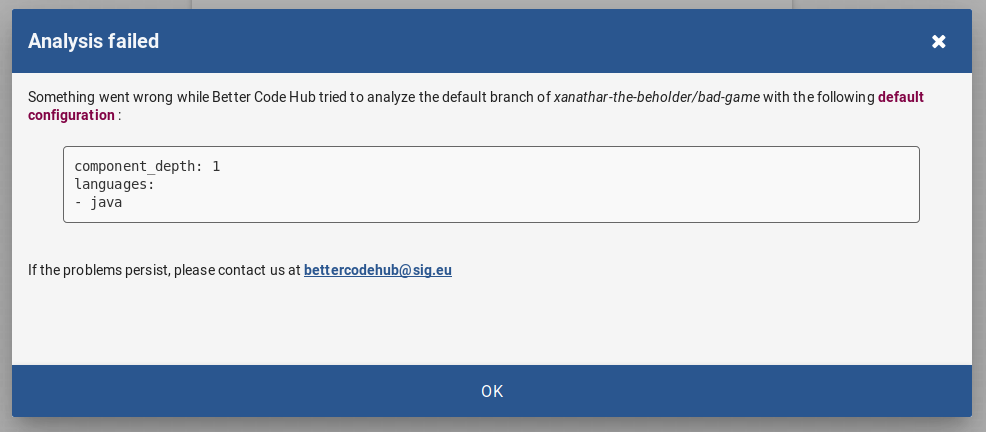

[](https://bettercodehub.com/)

# Bad Game

Proof that bad code can get a 10/10 rating on `bettercodehub.com`



## Background

I wrote this game for the [Java4K competition](http://www.java4k.com/index.php?action=games&method=view&gid=216) back in 2009. 
The objective of the competition is to put as much game as possible in a 4096 byte jar file.
This results in awful code because use of methods and fields eat up bytes quickly.
So the whole game was written mostly in the constructor, and almost all variables are local.

A perfect candidate to make it score 10/10 :-)

## Why?

Mostly because I wanted to know how bettercodehub works.

Also as a warning to any [managers](https://medium.com/bettercode/code-quality-human-variables-in-the-equation-616e9d2e8980), auditors and [teachers](https://medium.com/bettercode/higher-grades-for-better-code-23183648f793) that think that if a tool says the code is good, the code is good.

> There are things that can be measured. There are things that are worth measuring. But what can be measured is not always what is worth measuring; what gets measured may have no relationship with what we really want to know.

_(from 'The Tyranny of Metrics' by Jerry Z. Muller)_

See also [Goodhart's Law](https://en.wikipedia.org/wiki/Goodhart%27s_law) about the gaming of metrics.

## Refactoring to make things worse.

Basically I will be gaming the bettercodehub analyzer to achieve its definition of 'perfection' with as little effort as possible.

Most of the following tips should NEVER be performed on actual production code. 

### 4 Keep unit interfaces small

This is about the number of parameters the methods consume. 
If the number of parameters exceeds two the method enters the yellow category.

Lazy refactorings:
- Turn all local variables into fields. No parameters needed. If you need concurrency make everything synchronized.

### 1 Write Short Units of Code

This is the line count of the method including its signature. Yes line count, not statement count.

Lazy refactorings:
- simply put multiple statements on one line (don't accidently apply the code formatter later!)
- use the `extract to method` feature of your IDE to break up long methods. [Good names](https://www.youtube.com/watch?v=SctS56YQ6fg) are not scored.

### 2 Write Simple Units of Code

This is the number of branch points (if, for, while and case) in the method.

Lazy refactorings:
- use the `extract to method` feature of your IDE to break up long methods.
- use the `extract to method` feature of your IDE put conditionals in a separate method.
- Also note that conditionals within the streaming api (filter) or `Optional.orElse` do not count for complexity.

Is a class holding lots of short and simple methods with few arguments easier to maintain? 
Not necessarily. Read [Small functions considered harmful](https://medium.com/@copyconstruct/small-functions-considered-harmful-91035d316c29)

### 7 Keep Architecture components balanced.

This means that at a specific folder level there should be at least 2 folders which contain roughly the same amount of code.
I solved this by making a copy of the game in another package.

Then I had to deal with some duplication..

### 3 Write Code Once  

This checks for duplicate lines. About six of them seems to be the trigger.

Lazy refactorings:
- rename all fields to something else.
- rename method arguments to something else.
- put separate statements on one line.
- if possible change the order of statements.
- if the above fails, rename the method.

Also test code is not evaluated for duplication. 

### 9 Automate tests

Your test code should be at least half the number of lines of your production code.
Also 5% of the test code should be an `assert` statement.

Writing tests the bettercodehub way:
- It is not necessary to write tests that test something. 
- It is not necessary to have tests that pass (!).
- You do need lots of asserts.
- You do need to reference your class under test in some way.

The following will count as a valid test (and 7 lines with 57% asserts), but doesn't test anything:

```
    @Test
    public void shouldTest() {
        assertTrue(true);
        assertTrue(true);
        assertTrue(true);
        assertTrue(true);
    }
```

I simply made a few long test methods with lots of asserts in them.
 
### 10 Write Clean Code

The book mentions 7 code smells of which the first is covered by the other categories, so only 6 remain:
- Bad Comments
- Commented out code
- Badly Handled Exceptions
- Dead Code
- Long Identifiers
- Magic Values

In Bad Game there was some Commented out code, I simply removed those lines.
Also its full of Magic Values. Lucky enough the analyzer didn't detect those :)

I made (tests for all the cases)[https://github.com/xanathar-the-beholder/bad-testcases/blob/master/src/main/java/codesmells/WriteCleanCode.java]. 
I was surprised to find that I was not able to trigger all of them:
- Bad Comments: I found that a TODO comment triggers this rule. Some other examples in the book don't.
- Commented out code: the comments must contain references to method or variables defined the current class.
- Badly Handled Exceptions: No-op catch block detection works. Catching throwable doesn't.
- Dead Code: Nope.
- Long Identifiers: Nope.
- Magic Values: Nope.

## Bonus: how to crash the analyzer

Add a method with lots of semicolons;

```
    public void crash() {
        ;;;;;;;;;;;;;;;;;;;;;;;;;;;;;;;;;;;;;;;;;;;;;;;;;;;;;;;;;;;;;;;;;;;;;;;;;;;;;;;;;;;;;;;;;
        ;;;;;;;;;;;;;;;;;;;;;;;;;;;;;;;;;;;;;;;;;;;;;;;;;;;;;;;;;;;;;;;;;;;;;;;;;;;;;;;;;;;;;;;;;
        // repeat 128 times
        ;;;;;;;;;;;;;;;;;;;;;;;;;;;;;;;;;;;;;;;;;;;;;;;;;;;;;;;;;;;;;;;;;;;;;;;;;;;;;;;;;;;;;;;;;
        ;;;;;;;;;;;;;;;;;;;;;;;;;;;;;;;;;;;;;;;;;;;;;;;;;;;;;;;;;;;;;;;;;;;;;;;;;;;;;;;;;;;;;;;;;
    }
```

Or (use this class)[https://github.com/xanathar-the-beholder/bad-testcases/blob/master/src/main/java/crash/CrashTheAnalyzer.java].



## Bonus: Testcases for the rules

I've made a (companion project, bad-testcases)[https://github.com/xanathar-the-beholder/bad-testcases], that contains code that try to trigger or bypass the rules of bettercodehub. 

## What kind of analyzer is BetterCodeHub?

I don't think it is a dynamic code analyzer (an program that simulates execution) because such a program should give a more clear indication of code coverage and should report the errors in the testcases (invoking a method on a null reference, not testing anything etc).

It could be a static analyzer; however, a static analyzer should have spotted the dead if branch and the unused private method (like my IDE did). Also detecting magic values should have been easy. It may be that these checks simply aren't implemented yet.

The final option seems to me the most likely one; its a clever collection of string matching algorithms. This would explain the focus on lines of code both for method length and test coverage.   
  
# Conclusion

Bettercodehub is an good tool if you are honestly trying to improve your code.

However its checks are easily gamed. If there is extrinsic motivation at work (good grades, pressure from management, cake at the exit) it would not surprise me that the results from the tool won't match the code quality in reality.

A fool with a tool is still a fool :)  

Btw, did you try the game? It's good fun!
